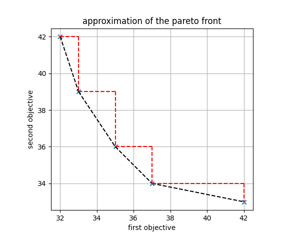

.. _tuto_biwlsp:

========================================
Bicriteria weighted latin square problem
========================================

.. include:: menu_backto.rst

Brief description
=================

In this variant of the :ref:`tuto_wlsp`, two objectives (sum of the costs of the cells) are optimized simultaneously. Each objective is defined by a cost matrix with possible costs for each cell in the chessboard. A subset of the pareto solutions can be obtained by solving linear combinations of the two criteria with various weights on the objectives. This can be achieved in ToulBar2 via a MultiCFN object.

CFN model
=========

Similarly to the :ref:`tuto_wlsp`, NxN variables are created with a domain size N.
In this model, the permutation of every row and every column is ensured through infinite costs in binary cost functions. 
Two different CFN are created to represent the two objectives: a first CFN where unary costs are added only from a first cost matrix, and a second one with unary costs from the second matrix.

Toulbar2 allows to either solve for a chosen weighted sum of the two cost objectives (cost function networks) as input, or approximate the pareto front by enumerating a complete set of non-redundant weights. As it is shown below, the method allows to compute solutions which costs lie in the convex hull of the pareto front. However, potential solutions belonging to the triangles will be missed with this approach.

Python model
============

The following code using the pytoulbar2 library solves the bicriteria weighted latin square problem with two different pairs of weights for the two objectives.

:download:`bicriteria_latinsquare.py<../../../web/TUTORIALS/bicriteria_latinsquare.py>`

.. literalinclude:: ../../../web/TUTORIALS/bicriteria_latinsquare.py

C++ model
============