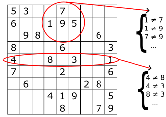

.. _tuto_sudoku_pytb2:

========================================
Sudoku puzzle
========================================

.. include:: menu_backto.rst

The Sudoku is a widely known puzzle game that consists in filling a grid with numbers.
The typical grid has 9x9 cells in total and each cell must contain an integer between 1 and 9.

Additional constraints need to be enforced to solve the puzzle.
In each line, the same number cannot appear twice.
The same type of constraint occurs for each column.
Finally, each sub square of size 3x3 located every 3 cells must also not contain duplicates.
The image bellow show an example of a Sudoku grid given with its initial values.
The goal is to deduce the other values while verifying the different constraints.

   A Sudoku grid partially filled where some of its constraints have been highlighted. Grid source: `Wikipedia <https://en.wikipedia.org/wiki/Sudoku/>`_

Getting started
=================

Before starting, make sure pytoulbar2 is present in your environment. It can be installed via the command:

.. code-block:: bash

   pip install pytoulbar2

We first create a CFN object. CFN, which stands for Cost Function Network, is the main object that is manipulated in pytoulbar2.
It represent a problem to solve expressed as a network of cost function, i.e a set of variables that are connected to each other through discret cost functions (or constraints).

As ToulBar2 is an optimization framework, an optional upper bound can be provided to the cfn object in order to exclude any solution which value exceed this bound.
In the case of a sudoku puzzle, since the problem does not contain a numerical objective, an upper bound of 1 can be chosen.

.. code-block:: python

   import pytoulbar2

   top = 1 # upper bound value of the problem
   cfn = pytb2.CFN(top)

Representing the grid in ToulBar2
=================

To represent our problem in pytoulbar2, it is necessary to define discrete decision variables.
The variables will represent the various choices that can be made to build a solution to the problem.
In the sudoku puzzle, decision variables are typically the different cells of the grid.
Their values would be the possible integers they can be assigned to, from 1 to 9.
We use the AddVariable function of the cfn object to make the variables.

.. code-block:: python

   # variable creation
   for row in range(9):
      for col in range(9):
         cfn.AddVariable('cell_'+str(row)+'_'+str(col), range(9))

Solving first the grid
=================

It is already possible to "solve" the puzzle with ToulBar2 as the cfn object contains the variables of the problem.
The :code:`Solve` function is used to run the solving algorithm.

.. code-block:: python

   result = cfn.Solve(showSolutions = 3)

If ToulBar2 finds a solution, it will return an array containing the chosen values for each variable:

.. code-block:: python

   print(result[0][0])

Would return :code:`0`, meaning the chosen value of the first variable (upper left cell) is 1 (first value of the list).
We then define a function to print the solutions as a grid :

.. code-block:: python

   # print a solution as a sudoku grid
   def print_grid(solution):

      print('-------------------------')

      var_index = 0

      for row in range(9):
         line = ''
         for col in range(9):
            if col % 3 == 0:
                  line += '|'
            line += ' ' 
            line += str(solution[var_index]+1)
            if col % 3 == 2:
                  line += ' '
            var_index += 1
         line += '|'
         print(line)
         if row % 3 == 2:
            print('-------------------------')

   # print the first solution
   print_grid(result)

Which helps to display the first solution:

.. code-block:: text

   -------------------------
   | 1 1 1 | 1 1 1 | 1 1 1 |
   | 1 1 1 | 1 1 1 | 1 1 1 |
   | 1 1 1 | 1 1 1 | 1 1 1 |
   -------------------------
   | 1 1 1 | 1 1 1 | 1 1 1 |
   | 1 1 1 | 1 1 1 | 1 1 1 |
   | 1 1 1 | 1 1 1 | 1 1 1 |
   -------------------------
   | 1 1 1 | 1 1 1 | 1 1 1 |
   | 1 1 1 | 1 1 1 | 1 1 1 |
   | 1 1 1 | 1 1 1 | 1 1 1 |
   -------------------------

Adding initial values
=================

The next step consists in initializing the variables that correspond to cells for which the value is known.
We will use the values in the grid example above, define as a double array (where 0 means the value is unspecified) :

.. code-block:: python

   # define known values
   initial_values = [[5,3,0,0,7,0,0,0,0],
                  [6,0,0,1,9,5,0,0,0],
                  [0,9,8,0,0,0,0,6,0],
                  [8,0,0,0,6,0,0,0,3],
                  [4,0,0,8,0,3,0,0,1],
                  [7,0,0,0,2,0,0,0,6],
                  [0,6,0,0,0,0,2,8,0],
                  [0,0,0,4,1,9,0,0,5],
                  [0,0,0,0,8,0,0,7,9]]

Variables can be assigned with the :code:`Assign` function.
The variable and its value can be specified as integers indexes or as strings.

.. code-block:: python

   var_index = 0
   for row in range(9):
    for col in range(9):
        if initial_values[row][col] != 0:
            cfn.Assign(var_index, initial_values[row][col]-1)
        var_index += 1

   result = cfn.Solve(showSolutions = 3)
   print_grid(result[0])

.. CAUTION::
   Although we already solve the problem once, a cfn object cannot execute its :code:`Solve` function twice in a row. The object must be recreated or the function must be called only once. 

The solution returned by the algorithm this time lookes like this :

.. code-block:: text

   -------------------------
   | 5 3 1 | 1 7 1 | 1 1 1 |
   | 6 1 1 | 1 9 5 | 1 1 1 |
   | 1 9 8 | 1 1 1 | 1 6 1 |
   -------------------------
   | 8 1 1 | 1 6 1 | 1 1 3 |
   | 4 1 1 | 8 1 3 | 1 1 1 |
   | 7 1 1 | 1 2 1 | 1 1 6 |
   -------------------------
   | 1 6 1 | 1 1 1 | 2 8 1 |
   | 1 1 1 | 4 1 9 | 1 1 5 |
   | 1 1 1 | 1 8 1 | 1 7 9 |
   -------------------------

The initial values are now correctly specified in the variables.

Adding constraints and solving the grid
=================

The last missing part before being able to compute a solution is the constraints.
Starting with the row constraints, we must ensure that none of the variables in the same row will be assigned to the same values.
This constraint is usually called *all different* and can be added with the :code:`AllDifferent` function.
The function takes as argument a list of indices of the variabe that must differ.
The constraint on the first row is obtained via :

.. code-block:: python
   
   cfn.AddAllDifferent([var_ind for var_ind in range(9)])

Which generates the following first row in the solution :

.. code-block:: text

   -------------------------
   | 5 3 1 | 2 7 4 | 9 8 6 |

Constraints for each rows can be added by varying the column index for each row :

.. code-block:: python

   # row constraints
   for row_ind in range(9):
      cfn.AddAllDifferent([row_ind*9+col_ind for col_ind in range(9)])

Constraints for each columns are obtained similarly :

.. code-block:: python

   # column constraints
   for col_ind in range(9):
      cfn.AddAllDifferent([row_ind*9+col_ind for row_ind in range(9)])

At this point, the solution is not correct yet since sub-grids of size 3x3 may contain duplicates, such as the values :code:`9`` and :code:`3` in the example bellow :

.. code-block:: text

   ---------
   | 5 3 9 |
   | 6 2 3 |
   | 1 9 8 |
   ---------

The constraint will be decomposed **pairwise**, meaning that a cost function will be define for each pair of variables in the row.

.. code-block:: python

   # sub grids constraints
   for sub_ind1 in range(3): # row offset
      for sub_ind2 in range(3): # column offset
         cfn.AddAllDifferent([(sub_ind1*3+row_ind)*9+ sub_ind2*3+col_ind for col_ind in range(3) for row_ind in range(3)])

These last constraints allow to finally obtain a consistent solution to the sudoku puzzle :

.. code-block:: text

   -------------------------
   | 5 3 4 | 6 7 8 | 9 1 2 |
   | 6 7 2 | 1 9 5 | 3 4 8 |
   | 1 9 8 | 3 4 2 | 5 6 7 |
   -------------------------
   | 8 5 9 | 7 6 1 | 4 2 3 |
   | 4 2 6 | 8 5 3 | 7 9 1 |
   | 7 1 3 | 9 2 4 | 8 5 6 |
   -------------------------
   | 9 6 1 | 5 3 7 | 2 8 4 |
   | 2 8 7 | 4 1 9 | 6 3 5 |
   | 3 4 5 | 2 8 6 | 1 7 9 |
   -------------------------

Conclusion
=================

TODO sudoku with multiple solutions ?

This short introduction shows how to represent a problem in ToulBar2 via its python interface by defining the problem variables and constraints and how to obtain a solution to this problem.
Below is the complete python script from this tutorial. 

:download:`sudoku_tutorial.py<../../../web/TUTORIALS/sudoku_tutorial.py>`

.. literalinclude:: ../../../web/TUTORIALS/sudoku_tutorial.py
