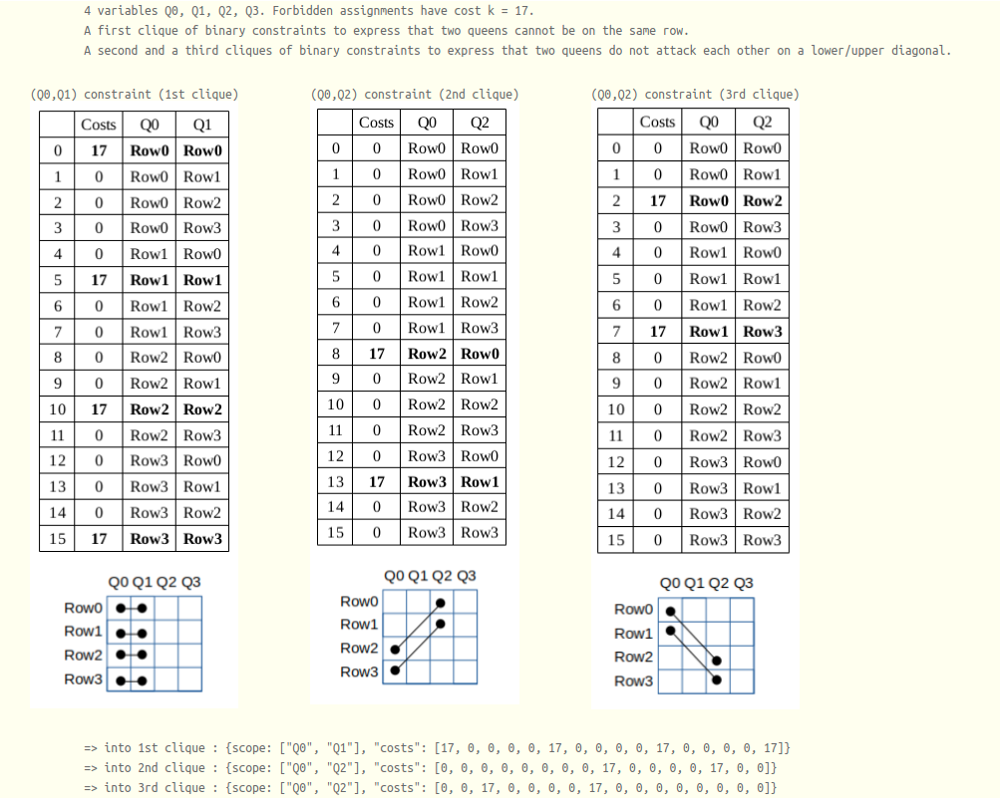

.. _wnqp:

========================
Weighted n-queen problem
========================

Brief description
=================

The problem consists in assigning N queens on a NxN chessboard with random weights in (1..N) associated to every cell such that each queen does not attack another queen and the sum of the weights of queen's selected cells is minimized.

CFN model
=========

A solution must have only one queen per column and per row. We create N variables for every column with domain size N to represent the selected row for each queen. A clique of binary constraints is used to express that two queens cannot be on the same row. Forbidden assignments have cost k=N**2+1. Two other cliques of binary constraints are used to express that two queens do not attack each other on a lower/upper diagonal.

Example for N=4 in JSON .cfn format
===================================

*More details :*

::

  {
    problem: { "name": "4-queen", "mustbe": "<17" },
    variables: {"Q0":["Row0", "Row1", "Row2", "Row3"], "Q1":["Row0", "Row1", "Row2", "Row3"], 
                "Q2":["Row0", "Row1", "Row2", "Row3"], "Q3":["Row0", "Row1", "Row2", "Row3"]},
    functions: {
      {scope: ["Q0", "Q1"], "costs": [17, 0, 0, 0, 0, 17, 0, 0, 0, 0, 17, 0, 0, 0, 0, 17]},
      {scope: ["Q0", "Q2"], "costs": [17, 0, 0, 0, 0, 17, 0, 0, 0, 0, 17, 0, 0, 0, 0, 17]},
      {scope: ["Q0", "Q3"], "costs": [17, 0, 0, 0, 0, 17, 0, 0, 0, 0, 17, 0, 0, 0, 0, 17]},
      {scope: ["Q1", "Q2"], "costs": [17, 0, 0, 0, 0, 17, 0, 0, 0, 0, 17, 0, 0, 0, 0, 17]},
      {scope: ["Q1", "Q3"], "costs": [17, 0, 0, 0, 0, 17, 0, 0, 0, 0, 17, 0, 0, 0, 0, 17]},
      {scope: ["Q2", "Q3"], "costs": [17, 0, 0, 0, 0, 17, 0, 0, 0, 0, 17, 0, 0, 0, 0, 17]},
      
      {scope: ["Q0", "Q1"], "costs": [0, 0, 0, 0, 17, 0, 0, 0, 0, 17, 0, 0, 0, 0, 17, 0]},
      {scope: ["Q0", "Q2"], "costs": [0, 0, 0, 0, 0, 0, 0, 0, 17, 0, 0, 0, 0, 17, 0, 0]},
      {scope: ["Q0", "Q3"], "costs": [0, 0, 0, 0, 0, 0, 0, 0, 0, 0, 0, 0, 17, 0, 0, 0]},
      {scope: ["Q1", "Q2"], "costs": [0, 0, 0, 0, 17, 0, 0, 0, 0, 17, 0, 0, 0, 0, 17, 0]},
      {scope: ["Q1", "Q3"], "costs": [0, 0, 0, 0, 0, 0, 0, 0, 17, 0, 0, 0, 0, 17, 0, 0]},
      {scope: ["Q2", "Q3"], "costs": [0, 0, 0, 0, 17, 0, 0, 0, 0, 17, 0, 0, 0, 0, 17, 0]},
      
      {scope: ["Q0", "Q1"], "costs": [0, 17, 0, 0, 0, 0, 17, 0, 0, 0, 0, 17, 0, 0, 0, 0]},
      {scope: ["Q0", "Q2"], "costs": [0, 0, 17, 0, 0, 0, 0, 17, 0, 0, 0, 0, 0, 0, 0, 0]},
      {scope: ["Q0", "Q3"], "costs": [0, 0, 0, 17, 0, 0, 0, 0, 0, 0, 0, 0, 0, 0, 0, 0]},
      {scope: ["Q1", "Q2"], "costs": [0, 17, 0, 0, 0, 0, 17, 0, 0, 0, 0, 17, 0, 0, 0, 0]},
      {scope: ["Q1", "Q3"], "costs": [0, 0, 17, 0, 0, 0, 0, 17, 0, 0, 0, 0, 0, 0, 0, 0]},
      {scope: ["Q2", "Q3"], "costs": [0, 17, 0, 0, 0, 0, 17, 0, 0, 0, 0, 17, 0, 0, 0, 0]},
      
      {scope: ["Q0"], "costs": [4, 4, 3, 4]},
      {scope: ["Q1"], "costs": [4, 3, 4, 4]},
      {scope: ["Q2"], "costs": [2, 1, 3, 2]},
      {scope: ["Q3"], "costs": [1, 2, 3, 4]}}
  }

Optimal solution with cost 11 for the 4-queen example :

.. image:: ../../web/IMAGES/queen4.png
   :height: 250px

Python model generator
======================

The following code using python3 interpreter will generate the previous example if called without argument. Otherwise the first argument is the number of queens N (e.g. "python3 queens.py 8").

.. note::
   Notice that the first lines of code (import and functions flatten and cfn) are needed by all the other tutorial examples.

:download:`queens.py<../../web/TUTORIALS/queens.py>`

.. literalinclude:: ../../web/TUTORIALS/queens.py

